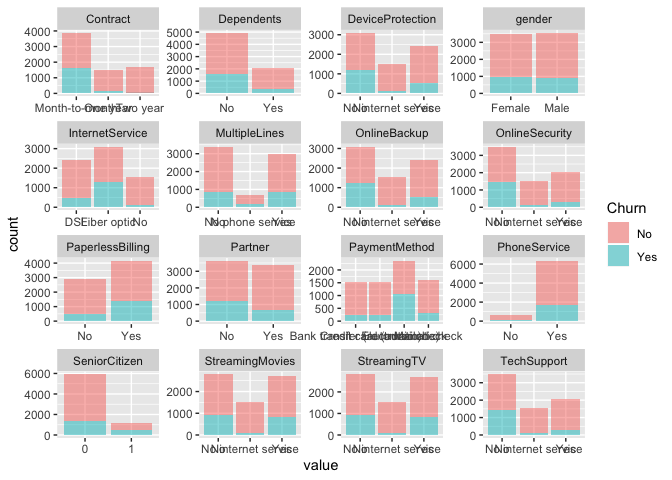
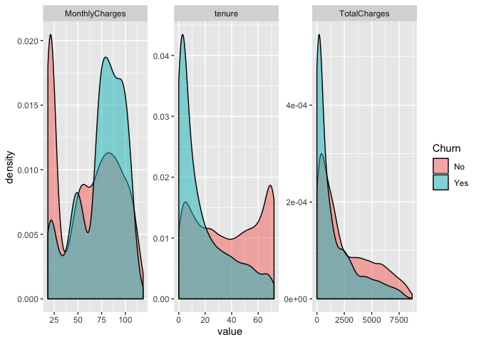
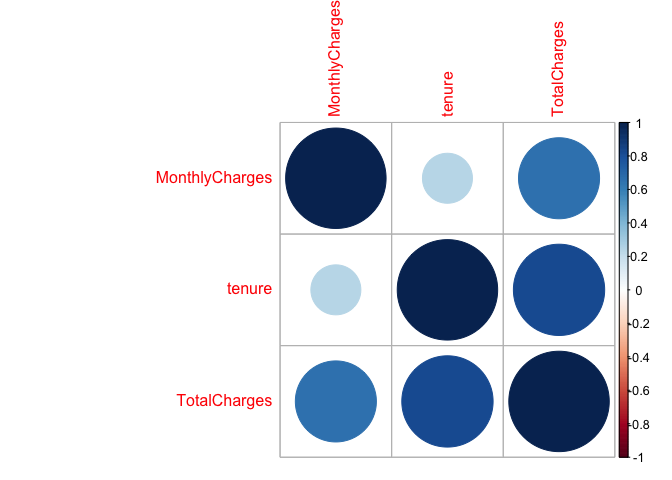
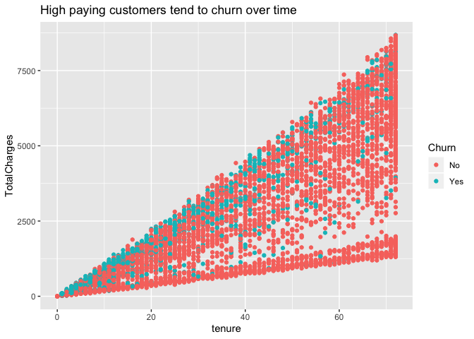
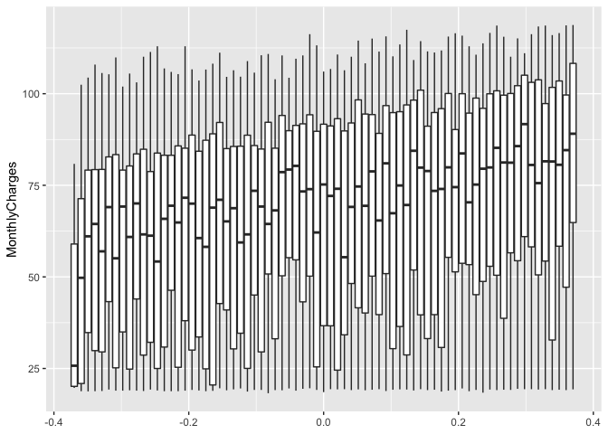

## 1. Define Problem

Using the dataset to assess the important features that management should consider in developing customer retention programme.

We focussed on two main questions:
* Can we accurately predict which customers will churn?
* Which factors heavily relate churn and can be used in a save strategy?

With sub questions of:
* How the model performs
* The financial savings from its implementation

## 2. Exploratory Data Analysis


```r
aia <- readr::read_csv('../data/AIA_Churn_Modelling_Case_Study.csv')
```

```
## Parsed with column specification:
## cols(
##   .default = col_character(),
##   SeniorCitizen = col_double(),
##   tenure = col_double(),
##   MonthlyCharges = col_double(),
##   TotalCharges = col_double()
## )
```

```
## See spec(...) for full column specifications.
```

```r
knitr::kable(head(aia)[,1:8])
```


customerID   gender    SeniorCitizen  Partner   Dependents    tenure  PhoneService   MultipleLines    
-----------  -------  --------------  --------  -----------  -------  -------------  -----------------
7590-VHVEG   Female                0  Yes       No                 1  No             No phone service 
5575-GNVDE   Male                  0  No        No                34  Yes            No               
3668-QPYBK   Male                  0  No        No                 2  Yes            No               
7795-CFOCW   Male                  0  No        No                45  No             No phone service 
9237-HQITU   Female                0  No        No                 2  Yes            No               
9305-CDSKC   Female                0  No        No                 8  Yes            Yes              

### Missing values

Review Missing Values by Feature. We see that TotalCharges is missing for 11 rows of the data. Customers with a `Tenure` of 0 have a missing `TotalCharge`. These have been imputed with 0.


```r
missing = colSums(is.na(aia))
data.frame(Feature = names(missing), Missing = missing) %>%
  arrange(desc(Missing)) %>%
  head %>%
  knitr::kable()
```


Feature          Missing
--------------  --------
TotalCharges          11
customerID             0
gender                 0
SeniorCitizen          0
Partner                0
Dependents             0

### Tenure Costs and TotalCharges

`Tenure` and `TotalCharge` are highly correlated. `Tenure` x `MonthlyCharges` is not equal to `TotalCharges`. An explanation is outside of this dataset. It could be: changes in plans, fines, changes in price of plans.


```r
aia %>%
  mutate(tenMon = tenure*MonthlyCharges,
         diff = (tenMon-TotalCharges)) %>%
  select(tenure, MonthlyCharges, TotalCharges, tenMon, diff, Churn) %>%
  head %>%
  knitr::kable()
```


 tenure   MonthlyCharges   TotalCharges    tenMon     diff  Churn 
-------  ---------------  -------------  --------  -------  ------
      1            29.85          29.85     29.85     0.00  No    
     34            56.95        1889.50   1936.30    46.80  No    
      2            53.85         108.15    107.70    -0.45  Yes   
     45            42.30        1840.75   1903.50    62.75  No    
      2            70.70         151.65    141.40   -10.25  Yes   
      8            99.65         820.50    797.20   -23.30  Yes   

## 3.Data Visualisation

The data is a mix of categorical and numeric variables. Data types converted for modelling and plotting.


```r
aia <- aia %>%
  select(-customerID) %>%
  mutate(gender = factor(gender),SeniorCitizen = factor(SeniorCitizen),
         Partner = factor(Partner), Dependents = factor(Dependents),gender = factor(gender),
         PhoneService = factor(PhoneService),MultipleLines = factor(MultipleLines),
         InternetService = factor(InternetService),OnlineSecurity = factor(OnlineSecurity),
         DeviceProtection = factor(DeviceProtection),TechSupport = factor(TechSupport),
         StreamingTV = factor(StreamingTV),StreamingMovies = factor(StreamingMovies),
         Contract = factor(Contract),PaperlessBilling = factor(PaperlessBilling),
         PaymentMethod = factor(PaymentMethod), Churn = factor(Churn)) %>%
  mutate(TotalCharges = if_else(is.na(TotalCharges), 0, TotalCharges))
```

### Categorical Variables

Gender is an uninteresting variable and will be dropped from modelling


```r
aia %>%
  select(-c(tenure, MonthlyCharges, TotalCharges)) %>%
  gather(key="key", value="value", -Churn) %>%
  drop_na() %>%
  ggplot(aes(x = value, fill = Churn)) +
  geom_bar(alpha = 0.5) +
  facet_wrap(~key, scales = "free")
```

<!-- -->

### Continuous Variables


```r
aia %>%
  select(c(tenure, MonthlyCharges, TotalCharges, Churn)) %>%
  gather(key="key", value="value", -Churn) %>%
  drop_na() %>%
  ggplot(aes(x = value, fill = Churn)) +
  geom_density(alpha = 0.5) +
  facet_wrap(~key, scales = "free")
```

<!-- -->

High correlation between `tenure` and `TotalCharges`. 


```r
aia %>%
  select(c(tenure, MonthlyCharges, TotalCharges)) %>%
  drop_na() %>%
  cor() %>%
  corrplot::corrplot(order = "hclust")
```

<!-- -->

High paying customers tend to churn over time


```r
aia %>%
  drop_na() %>%
  ggplot() +
  geom_point(aes(x=tenure, y = TotalCharges, colour = Churn)) +
  ggtitle('High paying customers tend to churn over time')
```

<!-- -->

#### Spread of data across tenure

There do not appear to be outliers in the `MonthlyCharges` when viewed by `tenure`.


```r
aia %>%
  select(c(tenure, MonthlyCharges)) %>%
  drop_na() %>%
  ggplot() +
  geom_boxplot(aes(group=tenure, y=MonthlyCharges))
```

<!-- -->

