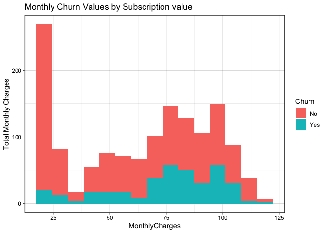
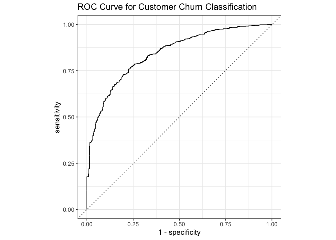
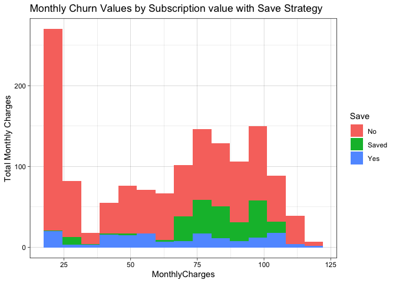

## 1. Define Problem

Using the dataset to assess the important features that management should consider in developing customer retention programme.

We focussed on two main questions:
* Can we accurately predict which customers will churn?
* Which factors heavily relate churn and can be used in a save strategy?

With sub questions of:
* How the model performs
* The financial savings from its implementation

## 2. Exploratory Data Analysis

The full EDA can be found [here](./edm.html).
The main findings are:

* The data is a mix of categorical and numeric variables
* There are no outliers in the numeric fields
* `Tenure` and `TotalCharge` are highly correlated. `Tenure` x `MonthlyCharges` is not equal to `TotalCharges`. An explanation is outside of this dataset. It could be: changes in plans, fines, changes in price of plans.

## 3. Data Cleaning
* Gender is an uninteresting variable and will be dropped from modelling
* Customers with a `Tenure` of 0 have a missing `TotalCharge`. These have been imputed with 0.


```r
aia <- read_csv("../data/AIA_Churn_Modelling_Case_Study.csv") %>%
  select(-customerID) %>%
  mutate(gender = factor(gender),SeniorCitizen = factor(SeniorCitizen),
         Partner = factor(Partner), Dependents = factor(Dependents),gender = factor(gender),
         PhoneService = factor(PhoneService),MultipleLines = factor(MultipleLines),
         InternetService = factor(InternetService),OnlineSecurity = factor(OnlineSecurity),
         DeviceProtection = factor(DeviceProtection),TechSupport = factor(TechSupport),
         StreamingTV = factor(StreamingTV),StreamingMovies = factor(StreamingMovies),
         Contract = factor(Contract),PaperlessBilling = factor(PaperlessBilling),
         PaymentMethod = factor(PaymentMethod), Churn = factor(Churn)) %>%
  mutate(TotalCharges = if_else(is.na(TotalCharges), 0, TotalCharges)) %>%
  select(-gender)
aia %>%
  select(c(1:7, Churn)) %>%
  head()
```

```
## # A tibble: 6 x 8
##   SeniorCitizen Partner Dependents tenure PhoneService MultipleLines
##   <fct>         <fct>   <fct>       <dbl> <fct>        <fct>        
## 1 0             Yes     No              1 No           No phone ser…
## 2 0             No      No             34 Yes          No           
## 3 0             No      No              2 Yes          No           
## 4 0             No      No             45 No           No phone ser…
## 5 0             No      No              2 Yes          No           
## 6 0             No      No              8 Yes          Yes          
## # … with 2 more variables: InternetService <fct>, Churn <fct>
```
## Data Pre-processing

### Splitting the data

The data is split into a train and test (80/20), stratified by Churn.


```r
### Split data
aia_split <- initial_split(aia, prop = 0.8, strata = "Churn")
aia_train <- training(aia_split)
aia_test <- testing(aia_split)
```

We can see the distribution of churning customers by their MonthlyCharges


```r
### Logreg before-after
before <- aia_test %>%
  ggplot() +
  geom_histogram(aes(MonthlyCharges, fill = Churn), bins =15) +
  ylab('Total Monthly Charges') +
  ggtitle('Monthly Churn Values by Subscription value') +
  theme_linedraw()
before
```

<!-- -->

### Pre-process

* TotalCharges has already been imputed
* Dummy variables will be created for all categorical, suitable for certain models (KNN, NN, GLM)
* Note: Data has not be regularised at this stage


```r
rec <- recipe(Churn ~ ., data = aia_train) %>%
  ## No imputation needed
  step_dummy(SeniorCitizen, Partner, Dependents, PhoneService, MultipleLines,
             InternetService, OnlineSecurity, OnlineBackup, DeviceProtection, TechSupport,
             StreamingTV, StreamingMovies, Contract, PaperlessBilling, PaymentMethod)
```

## Modelling

### Model Selection

This is a supervised learning classification problem. We'll use a logistic regression to start.
We've chosen a GLM over tree-based models as we want to have explainability to feed into our customer retention programme.


```r
logreg <- logistic_reg(mode = 'classification')
logreg <- logreg %>%
  set_engine("glm")
```

### Fitting the Model

Fit the training data set to our model


```r
fitted_model <- logreg %>%
  fit(Churn ~ ., data = aia_train) 
fitted_model$spec
```

```
## Logistic Regression Model Specification (classification)
## 
## Computational engine: glm 
## 
## Model fit template:
## stats::glm(formula = missing_arg(), data = missing_arg(), weights = missing_arg(), 
##     family = stats::binomial)
```

## Predict and Evaluate

### Predict

We make classification predictions using our fitted model.


```r
predictions <- bind_cols(
  select(aia_test, Churn),
  predict(fitted_model, aia_test)
  )
knitr::kable(head(predictions))
```


Churn   .pred_class 
------  ------------
No      Yes         
Yes     No          
No      No          
No      No          
No      No          
No      No          

### Evaluate

For evaluating the model we'll look at the:

* Confusion matrix
* Performance metrics Accuracy, Recall and precision
* ROC Curve for varied probability thresholds

#### Confusion Matrix


```r
confusion <- conf_mat(predictions, truth = Churn, estimate = .pred_class)
confusion
```

```
##           Truth
## Prediction  No Yes
##        No  915 161
##        Yes 119 212
```

#### Performance Metrics


```r
tidy_sum <- summary(confusion) %>%
  rename(Metric = .metric, Estimate = .estimate) %>%
  select(-.estimator)
knitr::kable(tidy_sum)
```


Metric                   Estimate
---------------------  ----------
accuracy                0.8009950
kap                     0.4702005
sens                    0.8849130
spec                    0.5683646
ppv                     0.8503717
npv                     0.6404834
mcc                     0.4716923
j_index                 0.4532776
bal_accuracy            0.7266388
detection_prevalence    0.7647477
precision               0.8503717
recall                  0.8849130
f_meas                  0.8672986

#### ROC Curve


```r
predictions <- bind_cols(
  select(aia_test, Churn),
  predict(fitted_model, aia_test, type='prob'),
  predict(fitted_model, aia_test) %>%
    rename(predicted = .pred_class)
  ) %>%
  rename(truth = Churn)

autoplot(roc_curve(predictions, truth, .pred_No)) +
  ggtitle("ROC Curve for Customer Churn Classification")
```

<!-- -->

## Business Impact

We are interested to know potential monthly savings

### Potential Saves


```r
predictions <- bind_cols(
  select(aia_test, Churn),
  predict(fitted_model, aia_test)
)
```

```
## Warning in predict.lm(object, newdata, se.fit, scale = 1, type = if (type
## == : prediction from a rank-deficient fit may be misleading
```

```r
save_edit <- predictions %>%
  mutate(Save = if_else((Churn == 'Yes') & (.pred_class == 'Yes'), 'Saved', as.character(Churn))) %>%
  select(-Churn)

sav_strat <- cbind(aia_test, save_edit)
sav_g <- sav_strat %>%
  ggplot() +
  geom_histogram(aes(MonthlyCharges, fill = Save), bins =15) +
  ylab('Total Monthly Charges') +
  ggtitle('Monthly Churn Values by Subscription value with Save Strategy') +
  theme_linedraw()
sav_g
```

<!-- -->

### Monthly Impact

An estimate for monthly impact could be (`average MonthlyCharges` x `number of retained churn customers` ) - (`cost of save strategy` x `identified customers`)
We assume:
* Cost of retention programme is £20 per customer in a month
* The success rate of the churn programme is 100%


```r
retention_cost <- 20 # £20
success_rate = 1.0 # 100%
mean_monthly <- round(mean(aia_test$MonthlyCharges), 2)
saved_customers <-confusion$table[4]
retentions_sent <- sum(confusion$table[c(3,4)])
per_thosound <- 1000 / dim(aia_test)[1]
((mean_monthly * saved_customers * success_rate) - (20 * retentions_sent)) * per_thosound
```

```
## [1] 4374.3
```

### Further Validating, tuning and Model review

#### Model Review - significant variables

We can see which features are vital to our model by looking at their z-scores. We take features with a probability less than 0.05 to be significant. Actionable features for a retention programme are:

* ContractType - longer contracts increase retention
* PaymentMethod - moving customers off electronic checks may increase retentions


```r
glm_stat <- glm(formula = Churn ~ ., family = binomial, data = aia_train)
glm_sum <- summary(glm_stat)

z_values <- data.frame(glm_sum$coefficients) %>%
  rownames_to_column(var = "Feature") %>%
  arrange(`Pr...z..`)
knitr::kable(head(z_values, n = 10))
```


Feature                            Estimate   Std..Error     z.value    Pr...z..
------------------------------  -----------  -----------  ----------  ----------
tenure                           -0.0592156    0.0069541   -8.515229   0.0000000
ContractTwo year                 -1.3778247    0.1954056   -7.051101   0.0000000
ContractOne year                 -0.7183534    0.1207008   -5.951522   0.0000000
PaperlessBillingYes               0.3570947    0.0833373    4.284932   0.0000183
TotalCharges                      0.0003126    0.0000790    3.955481   0.0000764
PaymentMethodElectronic check     0.2988596    0.1053920    2.835694   0.0045726
SeniorCitizen1                    0.2280654    0.0943382    2.417529   0.0156263
MultipleLinesYes                  0.3876631    0.1991037    1.947041   0.0515298
InternetServiceFiber optic        1.4900086    0.8965675    1.661903   0.0965321
InternetServiceNo                -1.4069043    0.9056266   -1.553515   0.1203002

#### Further Validation

We can validate our model using repeated cross-validation. We can also compare our logistic regression model to an `rpart` classification tree model.


```r
aia_folds <- vfold_cv(aia_train, v = 10, repeats = 5, strata = "Churn")
aia_indices <- rsample2caret(aia_folds)

ctrl_rsample_cv <- trainControl(index = aia_indices$index, classProbs = TRUE)

glm_model <- train(rec, data = aia_train,
                   method = "glm", trControl = ctrl_rsample_cv)
rpart_model <- train(rec, data = aia_train, method = "rpart",
                  trControl = ctrl_rsample_cv)
resamps <- resamples(list(RF = rpart_model,GLM = glm_model))

summary(resamps)
```

```
## 
## Call:
## summary.resamples(object = resamps)
## 
## Models: RF, GLM 
## Number of resamples: 50 
## 
## Accuracy 
##          Min.   1st Qu.    Median      Mean   3rd Qu.      Max. NA's
## RF  0.7442274 0.7780735 0.7888197 0.7895628 0.7996454 0.8209220    0
## GLM 0.7765957 0.7964528 0.8031915 0.8059253 0.8152753 0.8404255    0
## 
## Kappa 
##          Min.   1st Qu.    Median      Mean   3rd Qu.      Max. NA's
## RF  0.3008141 0.3665482 0.3995167 0.4005736 0.4382149 0.4993000    0
## GLM 0.3775489 0.4492483 0.4697883 0.4742583 0.5005204 0.5614763    0
```

Our logistic regression model performs better.

### Hyper parameter optimisation


